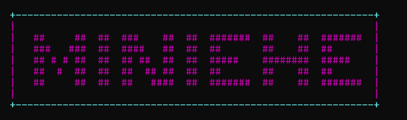

<div align="center">

# 🐚 MiniShell

### A modern Unix shell built from scratch in C

[](LICENSE)
[](https://en.wikipedia.org/wiki/C11_%28C_standard_revision%29)
[]()
[]()

A lightweight Unix-style shell implemented from scratch in C, featuring a custom line editor,
tab completion, persistent history, pipelines, redirection, background jobs, environment
expansion, globbing, and signal handling — with no third-party libraries.

</div>

<div align="center">



<br>

<sub>MiniShell v2.1 running on Windows through MSYS2</sub>

</div>

---

## 📖 Table of Contents

* [✨ Features](#-features)

  * [Core Shell Functionality](#core-shell-functionality)
  * [Line Editor](#line-editor)
  * [Job Control](#job-control)
  * [Persistent History](#persistent-history)
* [🎬 Demo](#-demo)
* [📸 Screenshots](#-screenshots)
* [🧰 Requirements](#-requirements)
* [🚀 Installation](#-installation)

  * [Linux / macOS](#linux--macos)
  * [Windows with MSYS2](#windows-with-msys2)
* [💻 Usage](#-usage)
* [📚 Built-in Commands](#-built-in-commands)
* [⌨️ Keyboard Shortcuts](#️-keyboard-shortcuts)
* [🏗 Architecture](#-architecture)
* [📁 Project Structure](#-project-structure)
* [🧪 Examples](#-examples)
* [🔬 How It Works](#-how-it-works)
* [🧪 Testing](#-testing)
* [🗺 Roadmap](#-roadmap)
* [🤝 Contributing](#-contributing)
* [📜 License](#-license)
* [👤 Author](#-author)

---

## ✨ Features

### Core Shell Functionality

* ✅ **External command execution** using `fork()` + `execvp()`
* ✅ **Pipelines** with `|`
* ✅ **Input/output redirection** with `<`, `>`, and `>>`
* ✅ **Background execution** with `&`
* ✅ **Sequential commands** with `;`
* ✅ **Environment expansion** with `$VAR`, `${VAR}`, `$?`, and `~`
* ✅ **Filename globbing** with `*`, `?`, and character classes
* ✅ **Signal handling** for `Ctrl+C`, `Ctrl+D`, and `Ctrl+Z`

### Line Editor

* ✅ Cursor movement with arrow keys
* ✅ `Home` / `End` navigation
* ✅ Command history navigation
* ✅ Persistent history between sessions
* ✅ Tab completion for commands and filesystem paths
* ✅ Emacs-style shortcuts
* ✅ UTF-8-aware cursor positioning
* ✅ Interactive terminal editing without external readline libraries

### Job Control

* ✅ Background job tracking
* ✅ `jobs` builtin
* ✅ Background process reaping
* ✅ Exit-status reporting
* ✅ Signal termination reporting

### Persistent History

* Stored in `~/.minishell_history`
* Survives shell restarts
* Consecutive duplicate commands are ignored
* Rolling history buffer of up to 500 entries

### Terminal Interface

* Two-line colored prompt
* Current user and working directory
* ASCII startup banner
* Colored status and error messages
* Clean built-in help output

---

## 🎬 Demo

```text
┌─[qusai@minishell] ~/projects/myshell
└─❯ ls *.c *.h
shell.c  utils.h

┌─[qusai@minishell] ~/projects/myshell
└─❯ cat src/*.c | grep "main" | wc -l
3

┌─[qusai@minishell] ~/projects/myshell
└─❯ echo "hello world" > out.txt

┌─[qusai@minishell] ~/projects/myshell
└─❯ cat < out.txt
hello world

┌─[qusai@minishell] ~/projects/myshell
└─❯ sleep 30 &

┌─[qusai@minishell] ~/projects/myshell
└─❯ jobs
  [1]  Running  sleep

┌─[qusai@minishell] ~/projects/myshell
└─❯ type gcc
gcc is /usr/bin/gcc
```

---

## 📸 Screenshots

<div align="center">

### Tab Completion


### Help Output


### Background Jobs


</div>

---

## 🧰 Requirements

| Component            | Minimum                | Recommended |
| -------------------- | ---------------------- | ----------- |
| **Operating System** | Linux, macOS, or MSYS2 | Linux       |
| **Compiler**         | GCC 10 / Clang 12      | GCC 13+     |
| **C Standard**       | C11                    | C11         |
| **Build Tool**       | GNU Make               | GNU Make    |

### Windows

MiniShell uses POSIX APIs such as:

```text
fork()
execvp()
pipe()
dup2()
termios()
unistd.h
```

For Windows, use one of the following:

* **MSYS2 MSYS**
* **WSL**
* **Cygwin**

For the native MSYS2 environment, use the **MSYS2 MSYS** terminal rather than UCRT64 or MinGW shells.

---

## 🚀 Installation

### Linux / macOS

```bash
git clone https://github.com/qusaijaber/MiniShell.git
cd MiniShell

make

./minishell
```

### Manual Build

If you prefer not to use Make:

```bash
gcc -Wall -Wextra -O2 -std=c11 -o minishell shell.c
./minishell
```

### Windows with MSYS2

#### 1. Install MSYS2

Download and install MSYS2 from:

https://www.msys2.org/

#### 2. Open MSYS2 MSYS

Launch the **MSYS2 MSYS** terminal.

#### 3. Install the compiler and Make

```bash
pacman -S --needed gcc make
```

#### 4. Clone the repository

```bash
git clone https://github.com/qusaijaber/MiniShell.git
cd MiniShell
```

#### 5. Build

```bash
make
```

#### 6. Run

```bash
./minishell.exe
```

---

## 💻 Usage

Start MiniShell with:

```bash
./minishell
```

### Basic Commands

```bash
ls -la
cat file.txt
grep -r "pattern" .
```

### Pipelines

```bash
ps aux | grep bash | wc -l
```

### Redirection

```bash
echo "hello" > file.txt
cat < file.txt
echo "another line" >> file.txt
```

### Sequential Commands

```bash
cd ~/projects ; ls ; pwd
```

### Background Jobs

```bash
sleep 60 &
jobs
```

---

## 📚 Built-in Commands

| Command            | Description                         |
| ------------------ | ----------------------------------- |
| `cd [dir]`         | Change the current directory        |
| `pwd`              | Print the current working directory |
| `echo [-n] [args]` | Print text                          |
| `clear`            | Clear the terminal                  |
| `history`          | Display command history             |
| `env`              | Display environment variables       |
| `set VAR=VAL`      | Set an environment variable         |
| `unset VAR`        | Remove an environment variable      |
| `export VAR=VAL`   | Export a variable                   |
| `type <cmd>`       | Show command type or location       |
| `jobs`             | Display background jobs             |
| `help`             | Display built-in help               |
| `exit`             | Exit MiniShell                      |
| `quit`             | Exit MiniShell                      |

---

## ⌨️ Keyboard Shortcuts

### Line Editing

| Key            | Action                          |
| -------------- | ------------------------------- |
| `←` / `→`      | Move cursor                     |
| `Home` / `End` | Move to beginning/end           |
| `Backspace`    | Delete previous character       |
| `Delete`       | Delete character at cursor      |
| `Ctrl+A`       | Move to beginning of line       |
| `Ctrl+E`       | Move to end of line             |
| `Ctrl+U`       | Delete from cursor to beginning |
| `Ctrl+K`       | Delete from cursor to end       |
| `Ctrl+W`       | Delete previous word            |

### History & Control

| Key       | Action                       |
| --------- | ---------------------------- |
| `↑` / `↓` | Navigate command history     |
| `Tab`     | Autocomplete                 |
| `Ctrl+L`  | Clear terminal               |
| `Ctrl+C`  | Cancel current command/input |
| `Ctrl+D`  | Exit on an empty line        |

---

## 🏗 Architecture

```text
┌─────────────────────────────────────────────────────────────┐
│                         main()                              │
│                           │                                 │
│                           ▼                                 │
│                 ┌───────────────────┐                      │
│                 │   Startup / UI     │                      │
│                 └─────────┬─────────┘                      │
│                           ▼                                 │
│                ┌──────────────────────┐                     │
│                │      REPL Loop       │                     │
│                │                      │                     │
│                │  job_reap()          │                     │
│                │  build_prompt()      │                     │
│                │  read_line()         │                     │
│                │  history_add()       │                     │
│                │  execute_line()      │                     │
│                └──────────┬───────────┘                     │
│                           │                                 │
│          ┌────────────────┼─────────────────┐               │
│          ▼                ▼                 ▼               │
│    ┌──────────┐     ┌─────────────┐   ┌─────────────┐      │
│    │ Built-ins│     │ Pipelines   │   │ Redirection │      │
│    │          │     │ fork + exec │   │ < > >>      │      │
│    └──────────┘     └─────────────┘   └─────────────┘      │
└─────────────────────────────────────────────────────────────┘
```

### Pipeline Stages

1. **Input** — Read the command line using the custom line editor.
2. **History** — Add the command to the persistent history.
3. **Sequential parsing** — Split commands using `;`.
4. **Tokenization** — Convert command text into argument tokens.
5. **Expansion** — Resolve environment variables and `~`.
6. **Pipeline parsing** — Identify commands separated by `|`.
7. **Redirection parsing** — Process `<`, `>`, and `>>`.
8. **Execution** — Run built-ins directly or spawn child processes.
9. **Waiting** — Wait for foreground pipelines or track background jobs.

---

## 📁 Project Structure

```text
MiniShell/
├── shell.c
├── Makefile
├── README.md
├── LICENSE
├── .gitignore
├── .editorconfig
├── .clang-format
└── docs/
    └── screenshots/
        ├── demo.png
        ├── tab.png
        └── help.png
```

> MiniShell is intentionally implemented as a compact single-source C project.

---

## 🧪 Examples

### Pipes

```bash
cat /etc/passwd | cut -d: -f1 | sort | uniq
```

### Redirection

```bash
ls -la > listing.txt
echo "appended line" >> listing.txt
wc -l < listing.txt
```

### Globbing

```bash
ls *.c
echo src/*/*.h
rm file?.tmp
```

### Environment Expansion

```bash
echo "Hello, $USER!"
echo "Home: ${HOME}"
echo "Last exit: $?"
```

### Background Jobs

```bash
sleep 10 &
jobs
```

### Sequential Execution

```bash
cd /tmp ; pwd ; ls ; cd -
```

---

## 🔬 How It Works

### Line Editor

MiniShell implements its own interactive line editor using POSIX `termios()`.

The terminal is temporarily placed into raw mode so input can be processed
character by character. Escape sequences are interpreted for cursor movement,
history navigation, deletion, and other keyboard operations.

After each modification, the current line is redrawn using ANSI escape sequences.

### Tab Completion

When `Tab` is pressed, MiniShell determines whether the cursor is currently
completing a command or a filesystem path.

For commands, executable files are searched through directories listed in
`$PATH`.

For filesystem completion, matching files and directories are scanned from the
current path.

If multiple candidates share a common prefix, MiniShell completes that prefix.

### Pipes and Redirection

For a pipeline:

```text
command1 | command2 | command3
```

MiniShell creates pipes between processes, then uses `fork()` and `dup2()` to
connect standard input and output between the processes.

Redirection uses `open()` followed by `dup2()` to replace the appropriate
standard file descriptor.

### Background Jobs

Commands ending with `&` are launched without blocking the interactive prompt.

MiniShell tracks their process information and periodically reaps finished
children to prevent zombie processes.

### Signal Handling

Interactive signal handling distinguishes between the shell itself and
foreground commands.

Signals such as `SIGINT` are handled so that interrupting a running command
does not terminate the shell itself.

---

## 🧪 Testing

### Smoke Test

```bash
make test
```

Example interactive test:

```bash
./minishell <<'EOF'
echo "hello" "$USER"
pwd
ls *.c | wc -l
exit
EOF
```

### Valgrind

For memory-leak analysis:

```bash
valgrind --leak-check=full \
         --show-leak-kinds=all \
         ./minishell
```

### AddressSanitizer + UndefinedBehaviorSanitizer

```bash
gcc -fsanitize=address,undefined \
    -g -std=c11 \
    -o minishell-debug \
    shell.c

./minishell-debug
```

---

## 🗺 Roadmap

The current implementation focuses on interactive shell fundamentals.

Future improvements may include:

* [ ] Aliases
* [ ] Command substitution `$(...)`
* [ ] Subshells `( ... )`
* [ ] Logical operators `&&` and `||`
* [ ] `Ctrl+R` reverse history search
* [ ] Configuration file such as `~/.minishellrc`
* [ ] Custom prompt configuration
* [ ] Script execution mode
* [ ] Improved multi-byte Unicode editing
* [ ] More comprehensive automated tests
* [ ] Modular source layout

---

## 🤝 Contributing

Contributions, bug reports, and suggestions are welcome.

### Development Workflow

```bash
git checkout -b feature/your-feature
```

Make your changes, test them, then commit:

```bash
git add .
git commit -m "Add your feature"
git push origin feature/your-feature
```

Open a Pull Request on GitHub.

### Code Style

* C11
* 4-space indentation
* `snake_case` for functions
* `UPPER_CASE` for constants
* Maximum line length: 100 characters
* Compile with `-Wall -Wextra`
* Avoid compiler warnings

---

## 📜 License

This project is licensed under the **MIT License**.

See [LICENSE](LICENSE) for the complete license text.

---

## 👤 Author

**Qusai Jaber**

* GitHub: [@qusaijaber](https://github.com/qusaijaber)

---

## 🙏 Acknowledgments

MiniShell was inspired by existing Unix shells and publicly available
systems-programming resources.

* [Bash](https://www.gnu.org/software/bash/)
* [Zsh](https://www.zsh.org/)
* [Fish](https://fishshell.com/)
* POSIX documentation
* [Stephen Brennan's "Write a Shell in C"](https://brennan.io/2015/01/16/write-a-shell-in-c/)

---

<div align="center">

### 🐚 MiniShell

**A compact Unix shell implemented from scratch in C.**

⭐ If you find the project useful, consider giving it a star.

Made with ❤️ and C

</div>
